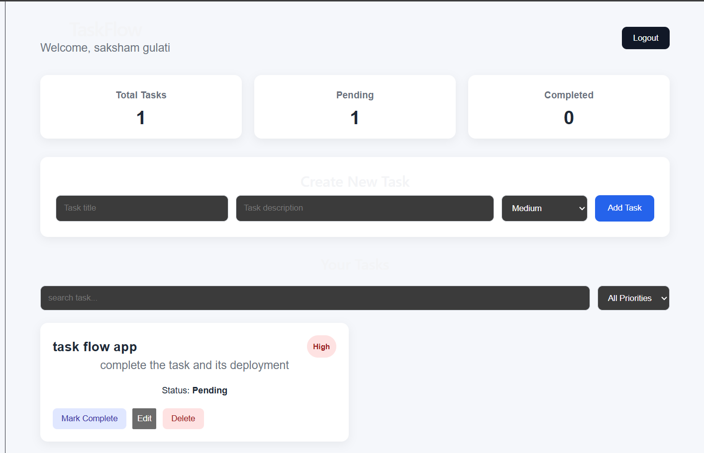
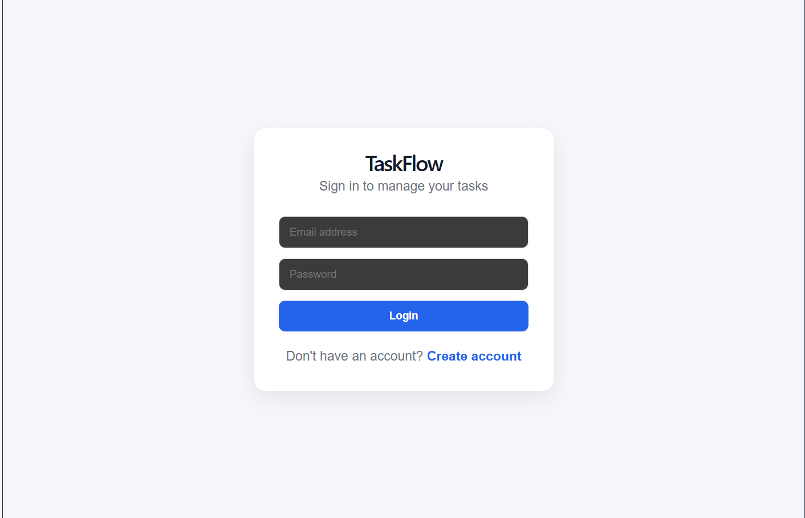
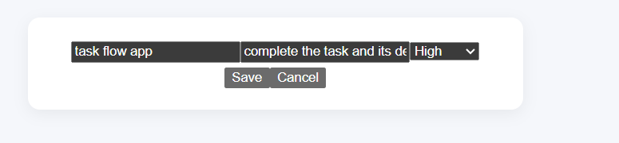

<div align="center">

# 🚀 TaskFlow

### Smart Task Manager built with the MERN Stack

<p>
  A modern full-stack task management application with secure authentication,
  CRUD operations, search, priority filters and a responsive dashboard.
</p>

<p>
  <a href="https://task-flow-seven-navy.vercel.app">
    
  </a>

  <a href="https://taskflow-api-94oy.onrender.com/health">
    
  </a>
</p>

<p>
  
  
  
  
</p>

</div>

<hr>
<h2 align="center">✨ Features</h2>

<table>
<tr>
<td width="50%">

### 🔐 Authentication

- User Registration
- Secure Login
- JWT Authentication
- Protected Routes

</td>

<td width="50%">

### ✅ Task Management

- Create Tasks
- Edit Tasks
- Delete Tasks
- Mark Complete / Pending

</td>
</tr>

<tr>
<td>

### 🔍 Productivity

- Search Tasks
- Filter by Priority
- Dashboard Statistics
- User-specific Tasks

</td>

<td>

### ⚡ User Experience

- Loading States
- Error Handling
- Responsive UI
- Cloud Data Persistence

</td>
</tr>
</table>

<hr>
<h2 align="center">🛠️ Tech Stack</h2>

<div align="center">

### Frontend


<br><br>

### Backend


<br><br>

### Tools & Deployment


</div>

<br>

<div align="center">

| Layer | Technologies |
|---|---|
| Frontend | React, Vite, React Router, Axios, CSS |
| Backend | Node.js, Express.js |
| Database | MongoDB, Mongoose |
| Authentication | JWT, bcryptjs |
| Deployment | Vercel, Render, MongoDB Atlas |

</div>

<hr>
<h2 align="center">📸 Project Preview</h2>

<p align="center">
  
</p>

<p align="center">
  <b>TaskFlow Dashboard</b>
</p>

<br>

<table>
<tr>
<td width="50%">

<p align="center">
  
</p>

<p align="center">
  <b>Login Page</b>
</p>

</td>

<td width="50%">

<p align="center">
  
</p>

<p align="center">
  <b>Edit Task</b>
</p>

</td>
</tr>
</table>

<hr>
<h2 align="center">🏗️ Project Architecture</h2>

<p align="center">
  TaskFlow follows a simple MERN architecture where the React frontend communicates
  with the Node.js + Express backend through REST APIs, and MongoDB Atlas stores the data.
</p>

```text
                ┌──────────────────────┐
                │        USER          │
                └──────────┬───────────┘
                           │
                           ▼
                ┌──────────────────────┐
                │   React + Vite       │
                │      Frontend        │
                │      Vercel          │
                └──────────┬───────────┘
                           │
                      Axios / REST API
                           │
                           ▼
                ┌──────────────────────┐
                │ Node.js + Express.js │
                │       Backend        │
                │       Render         │
                └──────────┬───────────┘
                           │
                        Mongoose
                           │
                           ▼
                ┌──────────────────────┐
                │    MongoDB Atlas     │
                │       Database       │
                └──────────────────────┘
<br> <h2 align="center">📁 Project Structure</h2>
TaskFlow/
│
├── client/
│   ├── src/
│   │   ├── components/
│   │   │   └── ProtectedRoute.jsx
│   │   │
│   │   ├── pages/
│   │   │   ├── Login.jsx
│   │   │   ├── Register.jsx
│   │   │   ├── Dashboard.jsx
│   │   │   ├── Auth.css
│   │   │   └── Dashboard.css
│   │   │
│   │   ├── services/
│   │   │   └── api.js
│   │   │
│   │   ├── App.jsx
│   │   └── main.jsx
│   │
│   ├── .env.example
│   └── package.json
│
├── server/
│   ├── config/
│   │   └── db.js
│   │
│   ├── controllers/
│   │   ├── authController.js
│   │   └── taskController.js
│   │
│   ├── middleware/
│   │   └── authMiddleware.js
│   │
│   ├── models/
│   │   ├── User.js
│   │   └── Task.js
│   │
│   ├── routes/
│   │   ├── authRoutes.js
│   │   └── taskRoutes.js
│   │
│   ├── .env.example
│   ├── server.js
│   └── package.json
│
├── screenshots/
│   ├── login.png
│   ├── dashboard.png
│   └── edit-task.png
│
├── .gitignore
└── README.md
<hr> ```
<h2 align="center">📡 API Endpoints</h2>

### 🔐 Authentication

| Method | Endpoint | Description |
|---|---|---|
| POST | `/api/auth/register` | Register a new user |
| POST | `/api/auth/login` | Login existing user |
| GET | `/api/auth/profile` | Access protected user profile |

### ✅ Tasks

| Method | Endpoint | Description |
|---|---|---|
| GET | `/api/tasks` | Fetch logged-in user's tasks |
| POST | `/api/tasks` | Create a new task |
| PUT | `/api/tasks/:id` | Update an existing task |
| DELETE | `/api/tasks/:id` | Delete a task |

<br>

<h2 align="center">🔐 Authentication Flow</h2>

```text
                ┌──────────────────────┐
                │        USER          │
                └──────────┬───────────┘
                           │
                           ▼
                ┌──────────────────────┐
                │  Email + Password    │
                │  sent to Backend     │
                └──────────┬───────────┘
                           │
                           ▼
                ┌──────────────────────┐
                │ Credentials Verified │
                └──────────┬───────────┘
                           │
                           ▼
                ┌──────────────────────┐
                │ JWT Token Generated  │
                └──────────┬───────────┘
                           │
                           ▼
                ┌──────────────────────┐
                │ Token stored in      │
                │ Local Storage        │
                └──────────┬───────────┘
                           │
                           ▼
                ┌──────────────────────┐
                │ Authorization Header │
                │ Bearer <token>       │
                └──────────┬───────────┘
                           │
                           ▼
                ┌──────────────────────┐
                │ Auth Middleware      │
                │ verifies JWT         │
                └──────────┬───────────┘
                           │
                           ▼
                ┌──────────────────────┐
                │ Protected Routes     │
                │ User's Own Tasks     │
                └──────────────────────┘
<p align="center"> 🔒 Each user can access and modify only their own tasks. </p> <hr>```

<h2 align="center">⚙️ Environment Variables</h2>

### Backend

Create a `.env` file inside the `server` folder:

```env
PORT=5000
MONGO_URI=your_mongodb_connection_string
JWT_SECRET=your_jwt_secret
Frontend

Create a .env file inside the client folder:

VITE_API_URL=http://localhost:5000/api

⚠️ Never commit your real .env files to GitHub.

<br> <h2 align="center">💻 Run Locally</h2>
1️⃣ Clone the Repository
git clone YOUR_GITHUB_REPOSITORY_URL
cd TaskFlow
2️⃣ Start the Backend
cd server
npm install
npm run dev

Backend will run on:

http://localhost:5000
3️⃣ Start the Frontend

Open a new terminal:

cd client
npm install
npm run dev

Frontend will usually run on:

http://localhost:5173
4️⃣ Open the App

Open in browser:

http://localhost:5173
<hr> ```
<h2 align="center">🚀 Deployment</h2>

<p align="center">
  TaskFlow is fully deployed using modern cloud platforms.
</p>

<div align="center">

| Layer | Platform | Status |
|---|---|---|
| Frontend | Vercel | 🟢 Live |
| Backend | Render | 🟢 Live |
| Database | MongoDB Atlas | 🟢 Connected |

</div>

<br>

<h3 align="center">🌐 Live Application</h3>

<p align="center">
  <a href="https://task-flow-seven-navy.vercel.app">
    
  </a>
</p>

<br>

<h3 align="center">🔗 Production URLs</h3>

<div align="center">

**Frontend**

https://task-flow-seven-navy.vercel.app

<br>

**Backend API**

https://taskflow-api-94oy.onrender.com

<br>

**Health Check**

https://taskflow-api-94oy.onrender.com/health

</div>

<br>

<h3 align="center">☁️ Deployment Flow</h3>

```text
GitHub Repository
       │
       ├──────────────► Vercel
       │               React Frontend
       │
       └──────────────► Render
                       Node + Express API
                              │
                              ▼
                       MongoDB Atlas
<p align="center"> Frontend communicates with the deployed backend using the <code>VITE_API_URL</code> environment variable. </p> <hr> ```
<h2 align="center">🧠 What I Learned</h2>

<p align="center">
  Building TaskFlow helped me understand how a complete full-stack application works from frontend to deployment.
</p>

<table>
<tr>
<td width="50%">

### 💻 Frontend

- React state management
- React Router
- Protected routes
- Axios API integration
- Search and filtering logic
- Loading and error states
- Responsive UI design

</td>

<td width="50%">

### ⚙️ Backend

- REST API development
- Express.js routing
- JWT authentication
- Authorization middleware
- Password hashing with bcrypt
- CRUD operations
- Error handling

</td>
</tr>

<tr>
<td width="50%">

### 🗄️ Database

- MongoDB data modelling
- Mongoose schemas
- User-task relationships
- User-specific data access
- MongoDB Atlas

</td>

<td width="50%">

### 🚀 Deployment

- Environment variables
- CORS configuration
- Render backend deployment
- Vercel frontend deployment
- Connecting production frontend and backend
- GitHub-based deployment workflow

</td>
</tr>
</table>

<br>

<h2 align="center">🔮 Future Improvements</h2>

<div align="center">

| Feature | Plan |
|---|---|
| 📅 Due Dates | Add deadlines to tasks |
| 🔔 Reminders | Notify users about upcoming tasks |
| 🌙 Dark Mode | Add light/dark theme support |
| ↕️ Sorting | Sort by date, status and priority |
| 🏷️ Categories | Organize tasks using tags |
| 🖱️ Drag & Drop | Reorder tasks visually |
| 📊 Analytics | Productivity and completion statistics |
| 🔑 Password Reset | Forgot password functionality |
| ✉️ Email Verification | Verify accounts using email |

</div>

<hr>
<h2 align="center">⭐ Support the Project</h2>

<p align="center">
  If you found TaskFlow useful or liked the project, consider giving the repository a ⭐ on GitHub.
</p>

<p align="center">
  <a href="https://task-flow-seven-navy.vercel.app">
    
  </a>
</p>

<br>

<div align="center">

### 🚀 TaskFlow

**Organize. Prioritize. Complete.**

<p>
  Built with ❤️ using the MERN Stack
</p>

<p>
  React • Node.js • Express.js • MongoDB • JWT • Vercel • Render
</p>

</div>